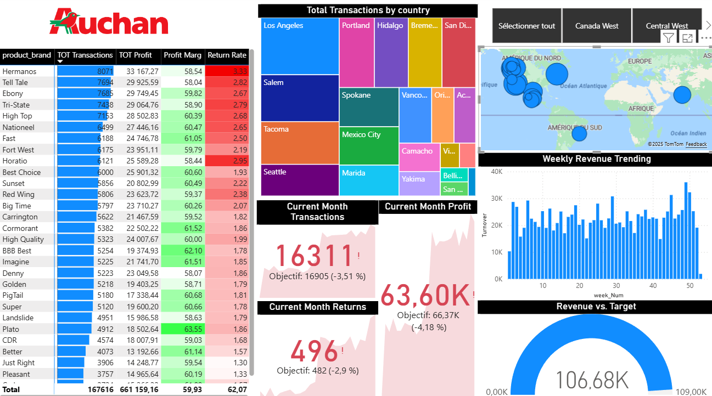
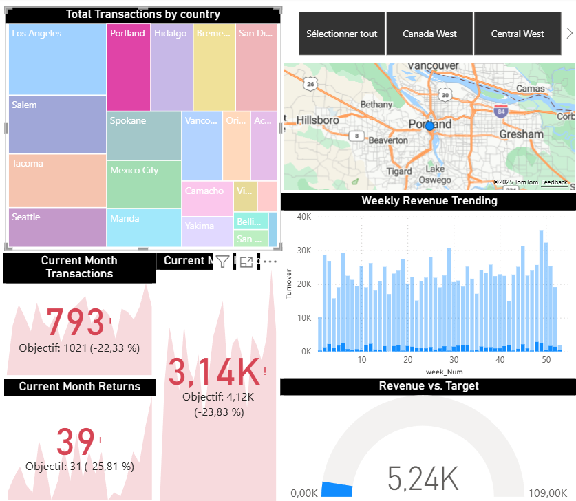
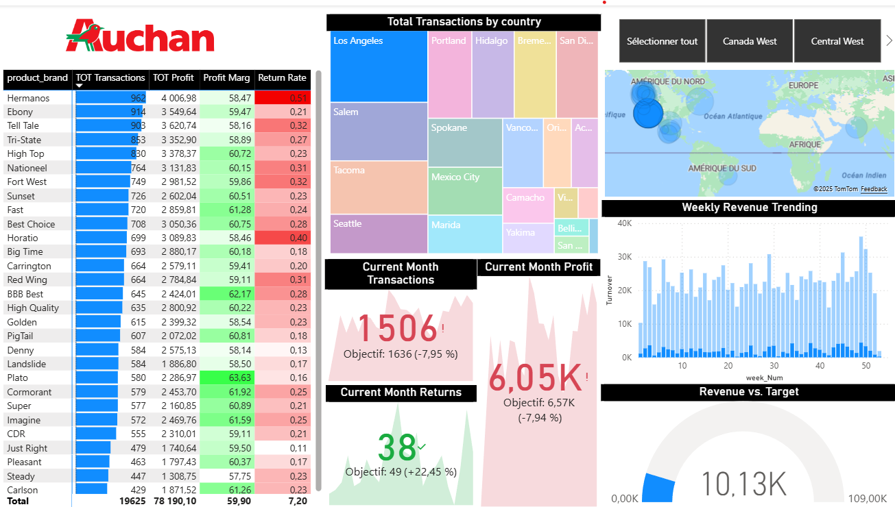

# Sidi Mohamed EL ABASS  
### Junior Data & AI Analyst | Supply Chain & Procurement | Power BI | Python | SQL | Snowflake

Bienvenue sur mon portfolio GitHub !  
Je suis actuellement étudiant en **MBA Big Data & Intelligence Artificielle (MBA ESG)** après avoir obtenu mon **Master en International Purchasing & Digital Supply Chain (ESCE)**.  
Je me spécialise dans l’analyse de données, la BI, la modélisation et l’optimisation des processus achats / supply chain.

---

À propos de moi

### Domaines d’expertise
- Data Analysis & Business Intelligence  
- Power BI (modélisation, DAX, KPI, bookmarks, reporting interactif)  
- SQL (PostgreSQL, Snowflake), Python  
- Modélisation décisionnelle & data warehouse  
- Excel avancé : Power Query, Data Models, Automatisation, **VBA**  
- Digitalisation des achats et optimisation supply chain  

### Technologies que j’utilise
- **Power BI** – ETL Power Query, DAX, dashboards  
- **Python** – Pandas, data cleaning, scripts  
- **SQL** – Analyse & Modélisation Data  
- **Snowflake** – Data modeling (MBA ESG)  
- **Excel / VBA**  
- Git & GitHub  

---

# Power BI Project — *Auchan Market Analysis*

Ce projet BI a été réalisé dans le cadre d’un cas pratique complet :  
connexion aux données, transformation, modélisation, création de mesures DAX, filtres avancés, bookmarks, analyse et visualisation.

Dataset : ventes multi-pays (USA, Canada, Mexique).

---

## Dashboard 1 — Vue générale (Topline Performance)

**Description :**  
Vue complète des performances globales : ventes, profit, taux de retour, carte des magasins, treemap par pays, tendances hebdomadaires et KPI du mois.  
Idéale pour analyser rapidement la performance globale de l’entreprise.

---

## Dashboard 2 — Vue filtrée (Exemple : Canada West)

**Description :**  
Affichage dynamique : lorsque l'utilisateur sélectionne une zone (ex. Canada West), tous les KPI et graphiques se mettent automatiquement à jour.  
Permet une analyse ciblée par région / pays / ville.

---

## Dashboard 3 — Focus détaillé (Exemple : Los Angeles)

**Description :**  
Focus sur une zone spécifique (ici Los Angeles). Tous les KPI, cartes et tendances se recalculent automatiquement.  
Ici, le **Current Month Return est positif**, ce qui affiche l’indicateur en vert car l’objectif est dépassé.

---

# Mon objectif GitHub

Créer un portfolio professionnel mettant en avant mes compétences en :
- Analyse de données  
- Business Intelligence  
- Décisionnel & modélisation  
- Développement Python / SQL  
- Projet data appliqué à la supply chain & aux achats  

Ce GitHub rassemblera progressivement :  
Mes dashboards Power BI  
Mes projets Python / SQL  
Des mini-projets analytiques  
Des scripts et outils d'automatisation  

---

# Contact  
📩 LinkedIn : https://www.linkedin.com/in/sidi-mohamed-el-abass/  
📄 CV : [Télécharger ici](./CV_SidiMohamed.pdf)

Merci pour votre visite 😊
